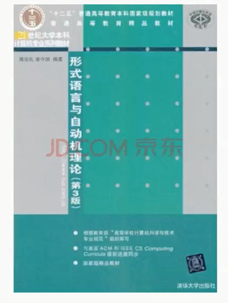

# 1、自然语言处理概述

参考资料：

## 重点1：形式语言

一般地，描述一种语言可以有三种途径：

（1）穷举法：

（2）文法描述（形式语言）：语言中的每个句子用严格定义的规则来构造，利用规则生成语言中合法的句子。

（3）自动机法：通过对输入的句子进行合法检验，区别哪些是语言中的句子，利用规则生成语言中的句子。

形式语法是一个四元组G = (N,Σ,P,S)，N是非终结符的有限集合；Σ是终结符的有限集合；V=NUΣ称为总词汇表；P是重写规则的有限集合：P=｛a->b｝,其中，a,b是由V中元素构成的串，但是，a中至少应含有一个非终结符号：S称为句子符或初始符。

阅读作业
1 宗成庆《统计自然语言处理》第2章“预备知识”，《形式语言与自动机》第1章1.2节，打好知识基础，后面会用到
2 宗成庆《统计自然语言处理》第4章“语料库与语言知识库”，按照所给的资源链接观摩一下资源的状况

书面作业
《形式语言与自动机》一书第2章习题：第5题，第7(1)题，第8(3)(6)(8)题

